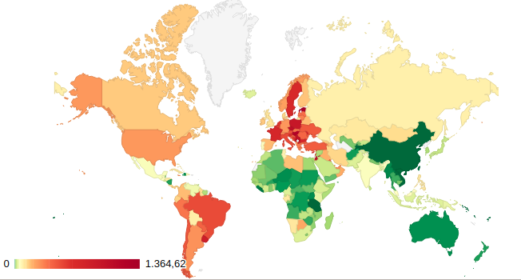

```{r setup, include=FALSE}
knitr::opts_chunk$set(echo = TRUE)
```

## Descripción

El conjunto de datos generado como parte de esta actividad práctica reúne diferentes características de la propagación del virus SARS-CoV-2 y los efectos de la enfermedad COVID-19 sobre la población segmentada por paises durante los últimos 100 días. Algunas de las variables que se recogen en el conjunto de datos son el país, la fecha, el incremento de muertos, número de muertos totales ...

## Imagen identificativa



## Contexto

En diciembre de 2019, un nuevo tipo de coronavirus, el SARS-CoV-2, aparece en la ciudad china de Wuhan y, tan solo tres meses más tarde, pone en jaque al mundo entero. Las consecuencias son miles de contagiados y fallecidos, hospitales desbordados, supermercados desabastecidos y economías colapsadas. En este dataset se recogen las variables más importantes durante los últimos 100 días que nos permiten analizar la evolución de la pandemia a lo largo del mundo. 


\newpage
## Contenido

Para cada registro se recogen las siguientes características:

* **País**: País en el que se obtienen los datos en formato string.  
* **Fecha**: Fecha en la que se recogen los datos en formato date "dd/mm/yyyy".   
* **Incremento_Muertos**: Número de muertos registrados en formato int.  
* **Muertos**: Suma del número de muertos registrados desde el inicio de la pandemia en formato int.  
* **Muertos_millon**: Número de muertos registrados por millón de habitantes en formato float.   
* **Incremento_Confirmados**: Numero de nuevos casos confirmados en formato int.  
* **Confirmados**: Suma del numero de nuevos casos confirmados desde el inicio de la pandemia en formato int.  
* **Confirmados_100k_14d**: Media móvil de los casos positivos de los últimos 14 días por cien mil habitantes en formato float.   

Los autores de la web *https://datosmacro.expansion.com/* llevan recopilando información sobre la evolución del COVID-19 desde el inicio de la pandemia. Las fuentes utilizadas por datosmacro.expansión son el Ministerio de Sanidad y The Center for Systems Science and Engineering (CSSE) at JHU.

## Agradecimientos

Los datos han sido recolectados desde la base de datos online [DatosMacro](https://datosmacro.expansion.com/otros/coronavirus). Para ello, se ha hecho uso del lenguaje de programación Python y de técnicas de *Web Scraping* para extraer la información alojada en las páginas HTML.

## Inspiración

El presente conjunto de datos podría utilizarse en ámbitos muy diversos. Uno de ellos podría ser en el periodístico, en el que disponer de los datos de la gran mayoría de accidentes de avión acontecidos en la historia podría valer para sacar a relucir aquellos que puedan resultar más interesante de cara a la realización de un reportaje.

También podría ser de gran utilidad en el campo de la *minería de datos*, a la hora de elaborar modelos predictivos (como por ejemplo árboles de decisión o redes neuronales). Así, se podría querer elaborar un modelo que permita predecir el número de víctimas mortales que podría ocasionar un avión en caso de accidente dadas las características del vuelo.


El presente conjunto de datos puede ser utilizarse desde diferentes ámbitos. Destacamos los principales agentes que pueden beneficiarse de este conjunto de datos y como:

* **Empresas y organizaciones privadas:** Para analizar la evolución de la pandemia y optimizar su toma de decisiones en cuanto a su actividad.  

* **Particulares:** Para disponer de información que les permita mantener actividades en entornos seguros y preveer el riesgo en cada momento. Para analizar y comparar los efectos de las medidas sanitarias implantadas en los diferentes paises.   

* **Medios de comunicación:** Para analizar y comparar los efectos de las medidas sanitarias implantadas en los diferentes paises. Para informar sobre la evolución de la pandemia.  

## Licencia

La licencia escogida para la publicación de este conjunto de datos ha sido **GNU GENERAL PUBLIC LICENSE v3.0**. Los motivos que han llevado a la elección de esta licencia tienen que ver con la idoneidad de las cláusulas que esta presenta en relación con el trabajo realizado:

* *Se debe proveer el nombre del creador del conjunto de datos generado, indicando los cambios que se han realizado*. De esta manera, se reconoce el trabajo ajeno y en qué medida se han realizado aportaciones en relación con el trabajo original.

* *Se permite un uso comercial*. Esto haría que incrementen las probabilidades de que una empresa utilice los datos generados y realicen trabajos de calidad que reporten cierto reconocimiento al autor original.

* *Las contribuciones realizadas a posteriori sobre el trabajo publicado bajo esta licencia deberán distribuirse bajo la misma*. Esto hace que el trabajo del autor original continúe distribuyéndose bajo los términos que él mismo planteó.

## Código fuente y dataset

Tanto el código fuente escrito para la extracción de datos como el dataset generado pueden ser accedidos a través de [este enlace](https://github.com/falamo1969/COVID-19_worldwide).
